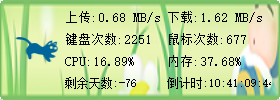

# keyboard/mouse/clipboard/memory/cpu monitor
1. 监测鼠标键盘剪切板敲击点击的次数，记录每天的生活
2. 监测CPU和内存使用率
3. 监测网络上下行实时网速
4. 每天的倒计时

## screenshot

## todos
* keyboard monitor   OK
* mouse monitor      OK
* clipboard monitor   X
* cpu monitor        OK
* memory monitor     OK
* network monitor    OK